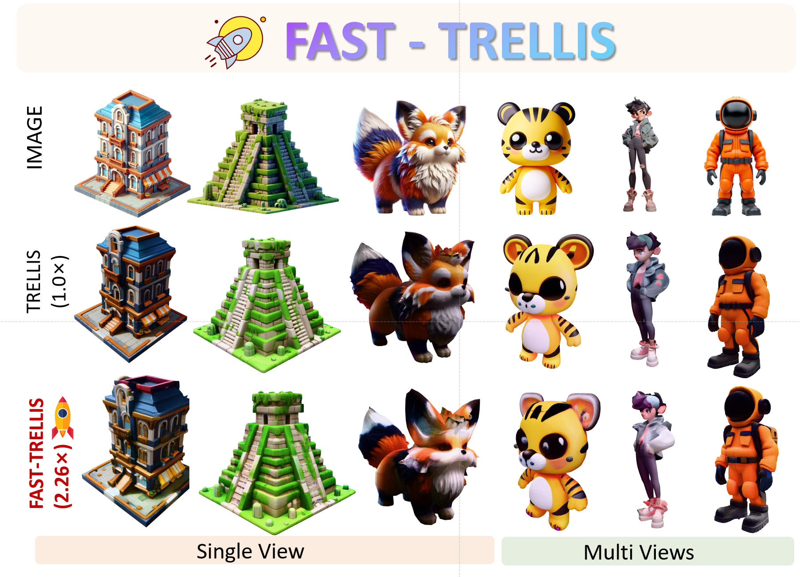
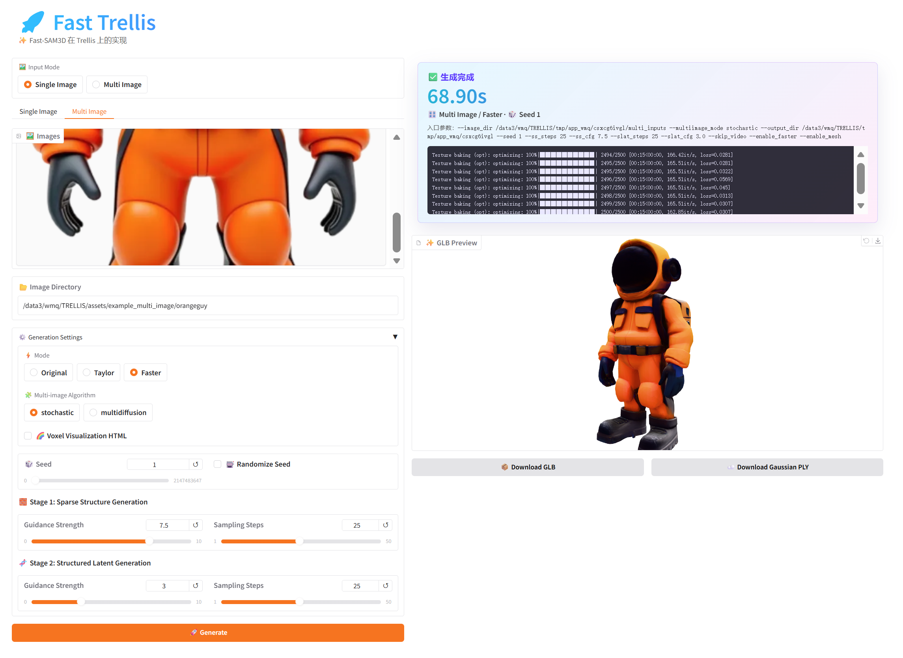

# 🚀 Fast-TRELLIS: Fast-SAM3D on TRELLIS

<p align="center">
  <a href="https://github.com/microsoft/TRELLIS">
    
  </a>
  <a href="https://github.com/wlfeng0509/Fast-SAM3D">
    
  </a>
  
</p>

<p align="center">
  <strong>Fast-TRELLIS</strong> is a TRELLIS implementation of the Fast-SAM3D acceleration framework.
</p>

---

<p align="center">
  
</p>
<p align="center">
  <strong>Fast-TRELLIS transfers the inference-time acceleration design of Fast-SAM3D to TRELLIS for efficient structured 3D generation.</strong>
</p>


## 📌 About This Repository

Fast-TRELLIS is based on **[Fast-SAM3D](https://github.com/wlfeng0509/Fast-SAM3D)** and ports its inference-time acceleration framework to **[TRELLIS](https://github.com/microsoft/TRELLIS)**. The migration covers the complete Fast-SAM3D design:

- **Modality-Aware Step Caching**
- **Joint Spatiotemporal Token Carving**
- **Spectral-Aware Token Aggregation**

<p align="center">
  ⭐ Star this repository if Fast-TRELLIS is helpful to your research or projects!
</p>

## ✨ Highlights

- 🚀 **TRELLIS acceleration**: Built on top of [microsoft/TRELLIS](https://github.com/microsoft/TRELLIS) with Fast-SAM3D-style inference-time acceleration.
- 🧩 **Plug-and-play design**: Supports original TRELLIS inference, TaylorSeer-style acceleration, and the full Fast-TRELLIS pipeline through simple runtime flags.
- ⚡ **Training-free speedup**: Reduces TRELLIS inference latency while preserving the main geometry metrics.
- 🖼️ **Single-view and multi-view inference**: Provides separate entry points for single-view generation and multi-view generation.
- 🛠️ **Official TRELLIS setup compatible**: Environment setup, configuration files, and model checkpoint download follow the official TRELLIS repository.

## 📂 Settings

This repository focuses on fast TRELLIS inference. For the base model architecture, configuration format, environment setup, and checkpoint preparation, please follow the official [microsoft/TRELLIS](https://github.com/microsoft/TRELLIS) instructions.

**Environment**

Fast-TRELLIS uses the official TRELLIS environment. Please install dependencies according to:

👉 [microsoft/TRELLIS - Installation](https://github.com/microsoft/TRELLIS)

**Models**

Model download and checkpoint placement are fully aligned with the official TRELLIS release.Please follow:

👉 [microsoft/TRELLIS - Model Download](https://github.com/microsoft/TRELLIS)

After downloading, place the weights into the `\checkpoints` directory.


## 🚀 Quick Start

**😍Gradio demo system**

<p align="center">
  
</p>

```
python app.py
```

**🖼️ Single-View Inference**

Use `example` for single-view inference:

```bash
# Original TRELLIS
python example.py

# TaylorSeer-style acceleration
python example.py --enable taylor

# Fast-TRELLIS acceleration
python example.py --enable faster --enable mesh
```

#### 🧭 Multi-View Inference

Use `example_multi` for multi-view inference:

```bash
# Original TRELLIS multi-view inference
python example_multi_image.sh

# TaylorSeer-style acceleration
python example_multi_image.sh --enable taylor

# Fast-TRELLIS multi-view acceleration
python example_multi_image.sh --enable faster --enable mesh
```


## 📊 Experimental Results

Our method is motivated by inference-time heterogeneity in structured 3D generation, rather than by SAM3D-specific training objectives. Therefore, the key components are in principle portable to other voxel-/latent-based pipelines.

To directly evaluate this transferability, we migrated the full Fast-SAM3D framework to TRELLIS and evaluated it on **Toys4K**. This transfer covers the complete inference-time design of Fast-SAM3D, including **Modality-Aware Step Caching**, **Joint Spatiotemporal Token Carving**, and **Spectral-Aware Token Aggregation**.

| Method | CD ↓ | F1@0.05 ↑ | vIoU ↑ | Latency (s) ↓ | GPU Memory (GB) ↓ |
| :-- | --: | --: | --: | --: | --: |
| TRELLIS | 0.0635 | 57.19 | 0.295 | 7.68 (1.00×) | 10.38 |
| +TaylorSeer | 0.0638 | 57.01 | 0.299 | 4.65 (1.65×) | 10.40 |
| +Fast3DCache | 0.0658 | 55.69 | 0.248 | 7.91 (0.97×) | 10.52 |
| **+Ours** | **0.0637** | **57.15** | **0.300** | **3.40 (2.26×)** | **9.97** |

On TRELLIS, our method reduces inference time from **7.68s** to **3.40s** (**2.26×**) while keeping the main geometry metrics essentially unchanged. It is also faster than TaylorSeer on this setup (**4.65s**) and avoids the stronger quality/runtime trade-off seen in Fast3DCache (**CD 0.0658**, **F1 55.69**, **vIoU 0.248**, **7.91s**).

These results support that the Fast-SAM3D acceleration framework is not tied to SAM3D only, but is also applicable to related structured, iterative voxel-/latent-based 3D generation backbones.


## 🧠 Reference

**Fast-SAM3D**

```bibtex
@misc{feng2026fastsam3d3dfyimagesfaster,
      title={Fast-SAM3D: 3Dfy Anything in Images but Faster}, 
      author={Weilun Feng and Mingqiang Wu and Zhiliang Chen and Chuanguang Yang and Haotong Qin and Yuqi Li and Xiaokun Liu and Guoxin Fan and Zhulin An and Libo Huang and Yulun Zhang and Michele Magno and Yongjun Xu},
      year={2026},
      eprint={2602.05293},
      archivePrefix={arXiv},
      primaryClass={cs.CV},
      url={https://arxiv.org/abs/2602.05293}, 
}
```


## 🙏 Acknowledgements

This project is based on the excellent [TRELLIS](https://github.com/microsoft/TRELLIS) repository and the Fast-SAM3D acceleration framework. We sincerely thank the authors and contributors for their inspiring work.

## 📄 License

This project is released under the [MIT License](LICENSE).

## 📧 Contact

For questions or suggestions, please open an issue or contact:

State Key Laboratory of AI Safety, Institute of Computing Technology, Chinese Academy of Sciences

- Mingqiang Wu [wumingqiang25e@ict.ac.cn](mailto:wumingqiang25e@ict.ac.cn)

- Weilun Feng: [fengweilun24s@ict.ac.cn](https://github.com/wlfeng0509/Fast-SAM3D/blob/main/fengweilun24s@ict.ac.cn)

  
